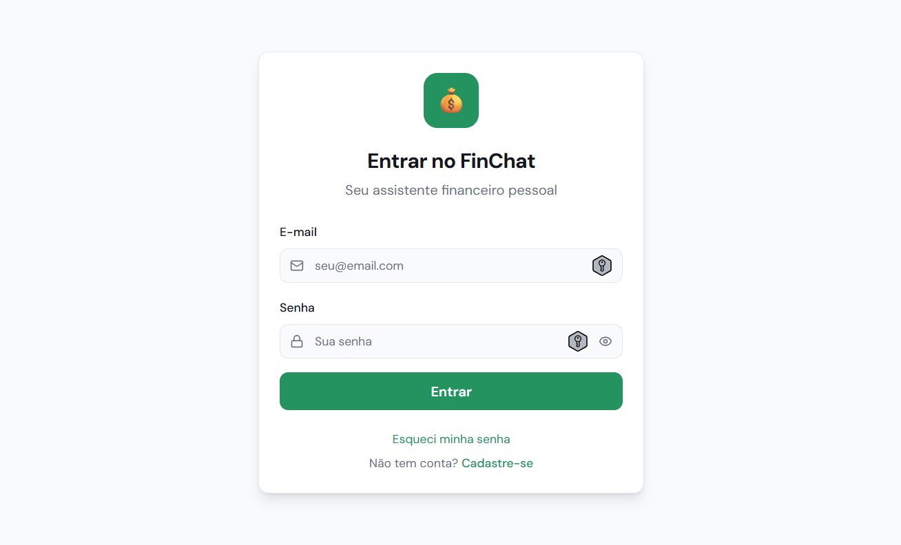
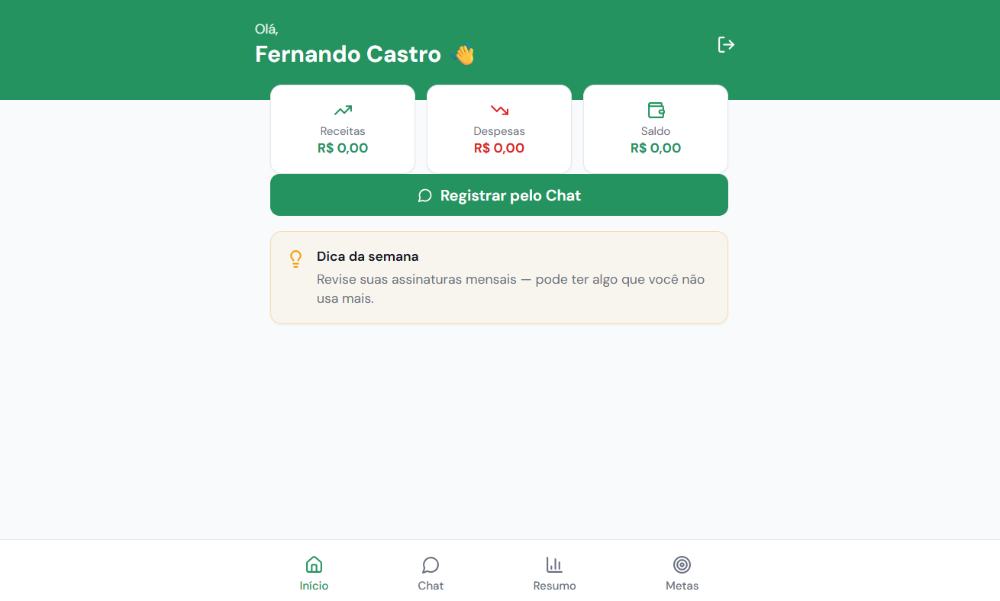

# 💸 Aplicativo de Organização de Finanças Pessoais Conversacional

Este projeto foi desenvolvido como um Desafio de Projeto da DIO de Vibe Coding utilizando o Lovable e o ChatGPT.

## 📌 Sobre o Projeto

A proposta é desenvolver um aplicativo de organização financeira pessoal baseado em conversação em linguagem natural, que permite ao usuário registrar, acompanhar e melhorar sua vida financeira de forma simples, intuitiva e humanizada — sem planilhas complexas ou formulários extensos.

O sistema atua como um **Agente Financeiro Inteligente**, entendendo comandos como:

> “Gastei 45 reais com pizza ontem”
> “Recebi 3 mil de salário hoje”
> “Quero guardar 500 reais por mês”

---

# 📄 PRD Final (Product Requirements Document)

PRD revisado com apoio do ChatGPT e utilizado como base para geração do App no Lovable.

<details>
<summary><strong>Clique para expandir o PRD completo</strong></summary>

```markdown
Crie um App de Finanças Pessoais com base no seguinte PRD (Product Requirements Document):

\# PRD – Aplicativo de Organização de Finanças Pessoais Conversacional

\## 1. Visão do Produto

Criar um aplicativo de organização financeira pessoal baseado em conversação em linguagem natural, permitindo que o usuário registre, acompanhe e melhore sua vida financeira de forma simples, intuitiva e humanizada.

O sistema atuará como um Agente Financeiro Inteligente, capaz de entender comandos como:

\- “Gastei 45 reais com pizza ontem”

\- “Recebi 3 mil de salário hoje”

\- “Quero guardar 500 reais por mês”

Sem necessidade de formulários complexos ou planilhas.

---

\## 2. Problema

Muitas pessoas:

\- Desistem de organizar suas finanças por excesso de fricção

\- Acham apps financeiros complexos

\- Não gostam de preencher formulários manualmente

\- Não entendem relatórios técnicos ou gráficos complicados

Isso gera:

\- Falta de controle financeiro

\- Endividamento

\- Ansiedade financeira

---

\## 3. Proposta de Valor

\- Controle financeiro simples

\- Registro por conversa

\- Classificação automática

\- Recomendações personalizadas

\- Experiência amigável e educativa

O diferencial é a experiência conversacional natural com inteligência contextual.

---

\## 4. Público-Alvo

\### Primário

\- Adultos iniciantes em educação financeira

\- Pessoas que nunca usaram planilhas

\- Usuários que querem simplicidade

\### Secundário

\- Pessoas com rotina corrida

\- Usuários que já tentaram apps financeiros e desistiram

---

\## 5. Objetivos do Produto

\- Reduzir a fricção no registro de gastos

\- Aumentar a frequência de uso

\- Melhorar a consciência financeira

\- Incentivar hábitos de economia

---

\## 6. Funcionalidades-Chave

\### 6.1 Autenticação seguro com e-mail e senha

O usuário deverá fazer login no App para acessar suas informações

Caso o usuário não tenha cadastro, deverá existir a opção para cadastramento

Caso o usuário não lembre sua senha, deverá existir a opção para recuperar e/ou cadastra nova senha

---

\### 6.2 Registro via Chat

Entrada em linguagem natural.

Exemplo:

“Gastei 45 reais no supermercado hoje.”

Reconhecimento de:

\- Valor

\- Data

\- Categoria

\- Tipo (receita ou despesa)

---

\### 6.3 Classificação Automática

\- Uso de IA para categorização

\- Sugestões e possibilidade de correção pelo usuário

\- Aprendizado baseado no histórico do usuário

Exemplos:

\- Supermercado → Alimentação

\- Uber → Transporte

\- Netflix → Assinaturas

---

\### 6.4 Metas Financeiras

\- Criar meta (ex: “Guardar 5 mil em 6 meses”)

\- Acompanhamento automático de progresso

\- Mostrar percentual atingido

\- Alertas inteligentes

---

\### 6.5 Agente Financeiro

\- Dicas personalizadas

\- Alertas de excesso de gasto

\- Sugestões de economia

\- Mensagens educativas

Exemplos:

“Você gastou 20% a mais com alimentação este mês.”

“Se economizar R$ 15 por dia, atinge sua meta em 4 meses.”

---

\### 6.6 Relatórios Simples

\- Resumo mensal

\- Principais categorias

\- Comparação com mês anterior

---

\### 6.7 Gráficos Funcionais e Acessíveis

\- Gráfico de pizza (distribuição de gastos)

\- Gráfico de barras (evolução mensal)

\- Versão textual alternativa para acessibilidade

---

\## 7. Requisito Obrigatório: Design Universal

O produto deve seguir princípios de Design Universal, garantindo:

\- Interface clara e simples

\- Textos objetivos

\- Ícones com rótulos

\- Alto contraste

\- Compatibilidade com leitores de tela

\- Linguagem inclusiva

\- Navegação intuitiva

\- Alternativa textual para gráficos

O app deve ser utilizável por:

\- Pessoas idosas

\- Pessoas com baixa familiaridade digital

\- Pessoas com deficiência visual leve

\- Usuários com baixa escolaridade financeira

---

\## 8. Entregável da IA

\## MVP – Produto Mínimo Viável

\## Objetivo do MVP

Validar se:

\- Usuários realmente preferem registrar gastos por conversa

\- O modelo de IA classifica corretamente

\- O agente gera valor percebido

---

\## Funcionalidades do MVP

\- Chat funcional com registro de despesas e receitas

\- Classificação automática básica

\- Resumo mensal simples

\- Gráfico de barras com versão textual alternativa

\- Criação de 1 meta ativa

\- Dica semanal automática

---

\## Principais Telas do MVP

\### 1. Tela Inicial

\- Saudação personalizada

\- Botão “Registrar pelo Chat”

\- Resumo rápido do mês

\### 2. Tela de Conversa

\- Campo de entrada

\- Histórico da conversa

\- Confirmação automática da transação

\### 3. Tela de Resumo

\- Total gasto

\- Total recebido

\- Saldo atual

\### 4. Tela de Metas

\- Criar meta

\- Visualizar progresso

---

\## Métricas de Validação Inicial

\- Percentual de usuários que registram ao menos 5 transações

\- Taxa de retenção em 7 dias

\- Correção manual da categoria inferior a 20%

\- Feedback qualitativo: “Foi fácil usar?”

```

</details>

---

# 🤖 Interações com o Lovable

Principais comandos utilizados:

```
Crie um App de Finanças Pessoais com base no seguinte PRD (Product Requirements Document): {PRD}
```

```
Ajuste para que tenha autenticação por e-mail e senha
```

```
Sim, com perfil (Você precisa armazenar dados de perfil do usuário (como nome, avatar, preferências) além do e-mail e senha?)
```

Configurações habilitadas:

* ✅ Habilitar Nuvem
* ✅ Modificar banco de dados

🔗 **Resultado final no Lovable:**
[https://app-organizador-financas-pessoais.lovable.app](https://app-organizador-financas-pessoais.lovable.app)

---

# 🖼️ Interface do Aplicativo

<table align="center">
  <tr>
    <td align="center">
      <br>
      <sub><b>Tela de Login do App</b></sub>
    </td>
    <td align="center">
      <br>
      <sub><b>Tela Inicial do App</b></sub>
    </td>
  </tr>
</table>

---

# 🚀 Funcionalidades do Aplicativo

## 1️⃣ Registro de Transações por Conversa

Permite registrar despesas e receitas utilizando linguagem natural.

**Recursos:**

* Entrada em texto livre (chat)
* Reconhecimento automático de valor
* Identificação de data
* Identificação de categoria
* Identificação de tipo (receita ou despesa)
* Confirmação automática da transação

**Exemplo:**

> Gastei 45 reais no supermercado hoje.

---

## 2️⃣ Classificação Automática Inteligente

Sistema de categorização automática com apoio de IA.

**Recursos:**

* Sugestão automática de categoria
* Possibilidade de correção manual
* Aprendizado baseado no histórico do usuário

---

## 3️⃣ Metas Financeiras

Permite criar e acompanhar objetivos financeiros.

**Recursos:**

* Criação de metas personalizadas
* Cálculo automático de progresso
* Exibição do percentual atingido
* Alertas inteligentes de acompanhamento

---

## 4️⃣ Agente Financeiro

Assistente virtual que oferece orientação personalizada.

**Recursos:**

* Recomendações de economia
* Alertas de excesso de gastos
* Sugestões de melhoria financeira
* Mensagens educativas

---

## 5️⃣ Relatórios Simplificados

Visão clara e objetiva da situação financeira.

**Recursos:**

* Resumo mensal de receitas e despesas
* Principais categorias de gastos
* Comparação com mês anterior

---

## 6️⃣ Visualização Gráfica Acessível

Gráficos simples e de fácil interpretação.

**Recursos:**

* Gráfico de barras
* Gráfico de distribuição por categoria
* Indicadores visuais de progresso
* Alternativa textual para acessibilidade

---

## 7️⃣ Design Universal

Interface projetada para inclusão e facilidade de uso.

**Princípios aplicados:**

* Interface clara e objetiva
* Alto contraste
* Compatibilidade com leitores de tela
* Linguagem inclusiva
* Navegação intuitiva

---

# 🧠 Reflexão sobre o Processo

## ✅ O que funcionou bem?

O refinamento prévio do PRD conduzido no ChatGPT foi determinante para a otimização do processo, considerando que os créditos disponíveis na plataforma Lovable foram consumidos após apenas duas interações.

As sugestões e melhorias incorporadas elevaram o nível de completude e detalhamento do PRD, permitindo sua utilização direta na plataforma com maior precisão e eficiência.

---

## ⚠️ O que não funcionou como o esperado?

Durante o processo de revisão assistida por IA surgiram desafios como:

* Necessidade de validação humana para evitar ambiguidades
* Risco de interpretações genéricas em requisitos pouco específicos
* Ajustes finos de escopo para adequação às limitações técnicas
* Retrabalho decorrente de desalinhamento entre expectativa funcional e implementação automatizada

Na utilização do Lovable:

* Consumo acelerado de créditos em ciclos iterativos
* Necessidade de refinamento incremental dos prompts
* Limitações quanto à personalização avançada e regras de negócio complexas

---

## 🎯 O que aprendi sobre conversar com IAs?

Conversar com IAs é um processo iterativo e estratégico.

A qualidade das respostas está diretamente relacionada ao nível de clareza, contexto e especificidade fornecidos no prompt.

Ficou evidente que:

* Instruções vagas geram saídas genéricas
* Prompts estruturados produzem resultados mais alinhados
* Etapas, validações intermediárias e refinamentos progressivos reduzem retrabalho

Aprendi também que a IA não substitui o pensamento crítico humano — ela potencializa a produtividade quando utilizada como ferramenta de apoio.

A precisão na comunicação impacta diretamente:

* Consumo de créditos
* Qualidade das entregas automatizadas
* Aderência ao PRD
